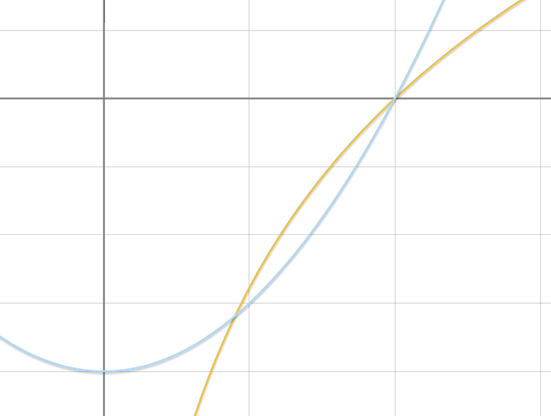

# 蒙特卡洛方法
### 【问题描述】

​	[蒙特卡洛方法](https://zh.wikipedia.org/wiki/%E8%92%99%E5%9C%B0%E5%8D%A1%E7%BE%85%E6%96%B9%E6%B3%95)是统计学里一个非常经典的方法。它具有非常广泛的用途，譬如现在非常火热的机器学习/人工智能领域就有用到（AlphaGo就有用到蒙特卡洛树搜索方法）。

​	此次实验以入门为目的，我们并不需要实现非常了不起的算法，只要了解蒙特卡洛方法的原理，并求解一两个小问题即可：

* 使用蒙特卡洛方法估算$\pi$（你不可以使用除`random`以外的任何库函数）

* 使用蒙特卡洛方法估算 $x^2-1$ 和 $\ln x$ 函数相交部分的面积，如图：

  
  这次你可以额外使用`math.log`函数 :P

### 【[解决思路](solution.md)】

