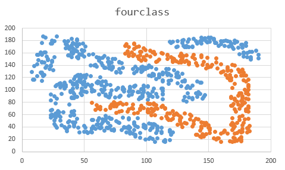

# Python机器学习

### 【解决思路】

1. 首先，你需要安装[scikit-learn](http://scikit-learn.org/)库，需要注意的是，这个库依赖于NumPy库，因此再次之前你还要安装NumPy，NumPy的安装稍为复杂，可以参考之前有关NumPy的题目。
2. 然后查阅[官方文档](http://scikit-learn.org/stable/documentation.html)，了解不同分类器特点，选择一个分类器进行实验。
3. 给定的数据集是csv格式。所以你还需要了解如何读取csv格式的数据文件。
4. 最后就是进行训练和测试了，要注意属性和类别之前的区别，还有一个非常重要的注意点是：**永远不要把训练数据当作测试数据来使用**，这很好理解，但是经常有人会忘了。因此你可以事先从原数据集中选取一部分数据作为测试集，并用于最后的正确性检验，剩下部分作为训练集。
5. sklearn库一个优点是api设计地高度统一，切换不同的分类器，你要修改的往往只有一行代码。你可以试着感受一下。

> 附所给的数据集分布图（不同颜色代表不同类别）：
>  